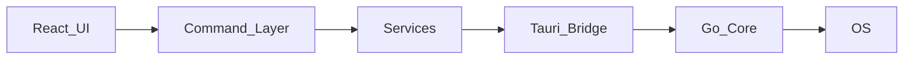

# Luna Editor

[日本語](#日本語) | [English](#english)

---

## 日本語

### Luna とは

**Luna Editor** は、軽量・高速・キーボードファーストな開発者向けワークスペースです。コードエディタにとどまらず、ファイル操作、コマンド実行、（将来）Git 統合や AI アクションをひとつにまとめます。

設計の優先順位は次のとおりです。

- **速い** — 起動と操作のレスポンスを最優先する
- **分かりやすい** — 隠れた状態を減らし、何が起きているか見えるようにする
- **邪魔しない** — 日常の開発フローを妨げない

中心となる UI は **左パレット** です。`npm run dev` や `git status` など、よく使うアクションをユーザーが自由に配置できるコントロールパネルとして機能します。

**技術スタック:** Tauri（Rust シェル）+ React / TypeScript（UI）+ Go（コア）

### 現状ステータス

> **Status:** 土台と縦切り 1 本が動作しています。
>
> 「フォルダを開く → ファイルツリー → エディタで表示 → 左パレットでコマンド実行」が、
> `UI → Command → Service → Rust ブリッジ → Go サイドカー → OS` の全層で実証済みです。

### クイックスタート

```sh
corepack enable
pnpm install
pnpm core:build
pnpm tauri dev
```

`corepack enable` が使えない環境では `corepack pnpm@9 <command>` で代用できます。前提ツールや詳細なセットアップ手順は後述の [セットアップ（詳細）](#セットアップ詳細) を参照してください。

### 主な機能

#### 実装済み

| 機能 | 概要 |
|------|------|
| フォルダを開く / ファイルツリー | ワークスペースのディレクトリ一覧（`fs.listDir`） |
| タブ + CodeMirror エディタ | 複数ファイルの表示・編集・保存 |
| 左パレット | ユーザー定義アクション（`palette.load` / `command.run`） |
| コマンド出力パネル | Echo Hello / Git Status / List Files などのワンショット実行 |
| Emmet | HTML / CSS / JSX 向けの略語展開 |
| Luna Dark テーマ | デフォルトのダークテーマ |

#### 未実装（次スライス）

コマンドパレット（Ctrl+Shift+P）、ripgrep 全文検索、Git 統合 UI、インタラクティブ PTY ターミナル、Luna Light テーマ、設定 UI、セッション復元、Basket、AI 連携、セキュアストレージ。

各機能は確立済みの縦軸（新しい Go メソッド + サービス + コマンド + UI）に沿って追加します。

### キーボードショートカット

| 操作 | Windows / Linux | macOS |
|------|-----------------|-------|
| フォルダを開く | Ctrl+O | Cmd+O |
| ファイルツリーの開閉 | Ctrl+B | Cmd+B |
| ターミナルパネルの開閉 | Ctrl+` | Cmd+` |
| 保存 | Ctrl+S | Cmd+S |
| タブを閉じる | Ctrl+W | Cmd+W |
| 次のタブ | Ctrl+Tab / Ctrl+PageDown | Cmd+Tab / Cmd+PageDown |
| 前のタブ | Ctrl+Shift+Tab / Ctrl+PageUp | Cmd+Shift+Tab / Cmd+PageUp |
| タブを選択（1〜9） | Ctrl+1 … Ctrl+9 | Cmd+1 … Cmd+9 |

#### Emmet（`.html` / `.css` / `.js` / `.jsx` / `.tsx`）

| 操作 | Windows / Linux | macOS |
|------|-----------------|-------|
| 略語を展開 | Tab | Tab |
| Abbreviation モード | Ctrl+E | Cmd+E |
| Wrap with Abbreviation | Ctrl+Shift+A | Cmd+Shift+A |
| 対応タグへ移動 | Ctrl+Shift+T | Cmd+Shift+T |
| コメント切替 | Ctrl+/ | Cmd+/ |

例: `.html` で `div.container>ul>li*3` と入力し **Tab** で展開。展開できない位置では **Tab** は通常のインデントになります。

### アーキテクチャ



| レイヤー | 役割 |
|----------|------|
| **React UI** (`src/`) | 描画・ショートカット・テーマ・パネル管理 |
| **Rust** (`src-tauri/`) | インフラのみ。`core_request` で Go サイドカーへ転送 |
| **Go コア** (`backend/`) | stdio 上の改行区切り JSON-RPC。ファイル・パレット・コマンド等 |

ユーザー設定は `~/.luna/` に JSON で保存されます（例: `palette.json`）。人間が直接編集できます。

詳細は [docs/architecture.md](docs/architecture.md) を参照してください。

### ディレクトリ構成

```
src/         React フロントエンド（ui / commands / services / store / themes / types / core）
src-tauri/   Tauri Rust シェル（サイドカー起動 + core_request ブリッジ）
backend/     Go コア（cmd/luna-core + filesystem / palette / command / …）
scripts/     アイコン生成スクリプト
docs/        設計ドキュメント
```

### 前提ツール

| ツール | バージョン | 用途 |
|--------|------------|------|
| Node.js | 18+ / 20+ | フロントエンド |
| pnpm | 9.x | パッケージ管理（`corepack` 経由を推奨） |
| Go | 1.22+ | コアサイドカー |
| Rust + Cargo | stable | Tauri シェルのビルド |
| make | 任意 | サイドカービルドの補助（無くても可） |

### セットアップ（詳細）

#### Go のインストール（macOS）

```sh
brew install go
go version   # go1.22 以上であること
```

#### Linux のシステム依存（Tauri 2）

Debian / Ubuntu 系で Tauri デスクトップをビルド・実行するには WebKitGTK 等が必要です。

```sh
sudo apt-get update
sudo apt-get install -y \
  libwebkit2gtk-4.1-dev build-essential curl wget file \
  libxdo-dev libssl-dev libayatana-appindicator3-dev librsvg2-dev
```

macOS は Xcode Command Line Tools、Windows は Visual Studio C++ Build Tools と WebView2 が必要です。

#### Go コアサイドカーのビルド

```sh
pnpm core:build
# または
make -C backend build
```

`make` が無い場合は直接ビルドします（triple は `rustc -vV` の `host:` 値）:

```sh
cd backend && go build -trimpath -ldflags "-s -w" \
  -o ../src-tauri/binaries/luna-core-$(rustc -vV | sed -n 's/host: //p') ./cmd/luna-core
```

#### アプリアイコン

本番用アイコンは次で一括生成できます。

```sh
pnpm icons
```

内部では `scripts/prepare-app-icon.mjs` がソース画像を用意し、Tauri CLI で各プラットフォーム用アイコンを出力します。

### 動作確認

1. 起動すると Luna のウェルカム画面（ショートカット一覧）が表示される。
2. **Ctrl+O**（macOS は **Cmd+O**）または左パレット上部のフォルダボタンでフォルダを開く → 左にファイルツリーが表示される。
3. ツリーのファイルをクリック → タブが開き、CodeMirror で内容を表示・編集できる。
4. 左パレットのボタン（`Echo Hello` / `Git Status` / `List Files`）をクリック → 下部ターミナルにコマンド出力が表示される。

### 検証コマンド

```sh
# Go コア（ユニットテスト + vet + フォーマット）
cd backend && go test ./... && go vet ./... && gofmt -l .

# フロントエンド（strict 型チェック + 本番ビルド）
pnpm typecheck
pnpm build
```

このリポジトリでは Go テスト・`tsc`・`vite build` が通ることを確認済みです。Tauri シェル（Rust）のビルドと GUI の通し確認は、WebKitGTK とディスプレイのある環境で `pnpm tauri dev` により実施してください。

### 関連ドキュメント

- [CLAUDE.md](CLAUDE.md) — プロジェクトビジョン・MVP 要件・コーディング規約
- [docs/architecture.md](docs/architecture.md) — レイヤー設計・データフロー
- [docs/ui.md](docs/ui.md) — UI コンポーネント方針

### ライセンス

[GNU General Public License v3.0](LICENSE)

---

## English

### What is Luna

**Luna Editor** is a lightweight, fast, keyboard-first developer workspace. It goes beyond a code editor by combining file operations, command execution, and (eventually) Git integration and AI actions in one place.

Design priorities:

- **Fast** — startup and interaction responsiveness come first
- **Clear** — fewer hidden states; you can see what is happening
- **Unobtrusive** — stays out of your daily development flow

The centerpiece is the **left palette** — a user-defined control panel where you can place actions such as `npm run dev`, `git status`, or custom scripts.

**Stack:** Tauri (Rust shell) + React / TypeScript (UI) + Go (core)

### Current status

> **Status:** Foundation and one vertical slice are working.
>
> “Open folder → file tree → edit in editor → run command from left palette” is proven end-to-end across
> `UI → Command → Service → Rust bridge → Go sidecar → OS`.

### Quick start

```sh
corepack enable
pnpm install
pnpm core:build
pnpm tauri dev
```

If `corepack enable` fails on your machine, use `corepack pnpm@9 <command>` instead. See [Detailed setup](#detailed-setup) below for prerequisites and platform-specific steps.

### Features

#### Implemented

| Feature | Description |
|---------|-------------|
| Open folder / file tree | Workspace directory listing (`fs.listDir`) |
| Tabs + CodeMirror editor | View, edit, and save multiple files |
| Left palette | User-defined actions (`palette.load` / `command.run`) |
| Command output panel | One-shot runs such as Echo Hello, Git Status, List Files |
| Emmet | Abbreviation expansion for HTML / CSS / JSX |
| Luna Dark theme | Default dark theme |

#### Not yet implemented (next slices)

Command palette (Ctrl+Shift+P), ripgrep project search, Git UI, interactive PTY terminal, Luna Light theme, settings UI, session restore, Basket, AI integration, secure storage.

Each feature will follow the established vertical path: new Go method + service + command + UI.

### Keyboard shortcuts

| Action | Windows / Linux | macOS |
|--------|-----------------|-------|
| Open folder | Ctrl+O | Cmd+O |
| Toggle file tree | Ctrl+B | Cmd+B |
| Toggle terminal panel | Ctrl+` | Cmd+` |
| Save | Ctrl+S | Cmd+S |
| Close tab | Ctrl+W | Cmd+W |
| Next tab | Ctrl+Tab / Ctrl+PageDown | Cmd+Tab / Cmd+PageDown |
| Previous tab | Ctrl+Shift+Tab / Ctrl+PageUp | Cmd+Shift+Tab / Cmd+PageUp |
| Select tab (1–9) | Ctrl+1 … Ctrl+9 | Cmd+1 … Cmd+9 |

#### Emmet (`.html` / `.css` / `.js` / `.jsx` / `.tsx`)

| Action | Windows / Linux | macOS |
|--------|-----------------|-------|
| Expand abbreviation | Tab | Tab |
| Enter abbreviation mode | Ctrl+E | Cmd+E |
| Wrap with abbreviation | Ctrl+Shift+A | Cmd+Shift+A |
| Go to matching tag pair | Ctrl+Shift+T | Cmd+Shift+T |
| Toggle comment | Ctrl+/ | Cmd+/ |

Example: in `.html`, type `div.container>ul>li*3` and press **Tab** to expand. Where expansion does not apply, **Tab** indents as usual.

### Architecture


| Layer | Role |
|-------|------|
| **React UI** (`src/`) | Rendering, shortcuts, themes, panel layout |
| **Rust** (`src-tauri/`) | Infrastructure only; forwards via `core_request` to the Go sidecar |
| **Go core** (`backend/`) | Newline-delimited JSON-RPC over stdio; files, palette, commands, etc. |

User settings live in `~/.luna/` as editable JSON (e.g. `palette.json`).

See [docs/architecture.md](docs/architecture.md) for full design notes.

### Directory layout

```
src/         React frontend (ui / commands / services / store / themes / types / core)
src-tauri/   Tauri Rust shell (sidecar launch + core_request bridge)
backend/     Go core (cmd/luna-core + filesystem / palette / command / …)
scripts/     Icon generation scripts
docs/        Design documentation
```

### Prerequisites

| Tool | Version | Purpose |
|------|---------|---------|
| Node.js | 18+ / 20+ | Frontend |
| pnpm | 9.x | Package manager (`corepack` recommended) |
| Go | 1.22+ | Core sidecar |
| Rust + Cargo | stable | Tauri shell build |
| make | optional | Sidecar build helper (not required) |

### Detailed setup

#### Install Go (macOS)

```sh
brew install go
go version   # must be go1.22 or newer
```

#### Linux system dependencies (Tauri 2)

On Debian / Ubuntu you need WebKitGTK and related packages to build and run the desktop app:

```sh
sudo apt-get update
sudo apt-get install -y \
  libwebkit2gtk-4.1-dev build-essential curl wget file \
  libxdo-dev libssl-dev libayatana-appindicator3-dev librsvg2-dev
```

macOS requires Xcode Command Line Tools; Windows requires Visual Studio C++ Build Tools and WebView2.

#### Build the Go core sidecar

```sh
pnpm core:build
# or
make -C backend build
```

Without `make`, build directly (triple from `rustc -vV` `host:` line):

```sh
cd backend && go build -trimpath -ldflags "-s -w" \
  -o ../src-tauri/binaries/luna-core-$(rustc -vV | sed -n 's/host: //p') ./cmd/luna-core
```

#### App icons

Generate production icons with:

```sh
pnpm icons
```

This runs `scripts/prepare-app-icon.mjs` to prepare the source image, then the Tauri CLI emits platform assets.

### Smoke test

1. On launch, Luna shows a welcome screen with shortcut hints.
2. Press **Ctrl+O** (**Cmd+O** on macOS) or use the folder button at the top of the left palette → file tree appears on the left.
3. Click a file in the tree → a tab opens and CodeMirror shows the content for editing.
4. Click a left-palette button (`Echo Hello`, `Git Status`, `List Files`) → output appears in the bottom terminal panel.

### Verification

```sh
# Go core (unit tests + vet + format check)
cd backend && go test ./... && go vet ./... && gofmt -l .

# Frontend (strict typecheck + production build)
pnpm typecheck
pnpm build
```

Go tests, `tsc`, and `vite build` are expected to pass in this repository. Full Tauri (Rust) shell build and GUI smoke testing require WebKitGTK and a display; run `pnpm tauri dev` in that environment.

### Related documentation

- [CLAUDE.md](CLAUDE.md) — vision, MVP scope, coding conventions
- [docs/architecture.md](docs/architecture.md) — layer design and data flow
- [docs/ui.md](docs/ui.md) — UI component guidelines

### License

[GNU General Public License v3.0](LICENSE)
